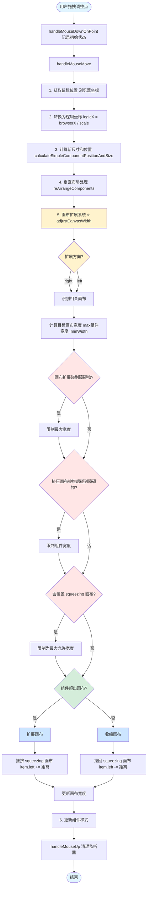
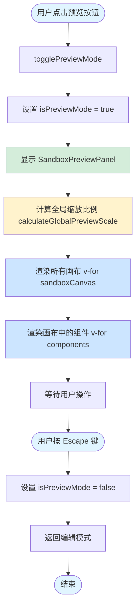

# Dashboard 仪表板技术架构文档

## 📋 文档概述

本文档基于 `SandboxDashEditor.vue` 及其关联文件，详细介绍了产品矩阵 Dashboard 仪表板系统的技术架构、核心功能和实现原理。

**文档版本**: v1.0  
**最后更新**: 2025-10-29  
**技术栈**: Vue 3 + TypeScript + Pinia + Vite

---

## 🎯 系统概览

### 系统定位

这是一个**可视化仪表板编辑系统**，支持通过拖拽方式创建多画布布局的 Dashboard，具有智能布局、自适应缩放、画布挤压等高级特性。

### 核心特性

1. **多画布沙盒管理** - 支持多个独立画布同时存在并智能布局
2. **智能组件布局** - 自动检测碰撞、位置交换、自动排列
3. **自适应缩放系统** - 响应式缩放，保持布局完整性
4. **画布动态扩展** - 画布可根据内容自动扩展，并推挤相邻画布
5. **实时预览模式** - 支持实时预览最终效果

---

## 🏗️ 整体架构

### 架构图

```
┌─────────────────────────────────────────────────────────────┐
│                    SandboxDashEditor (主容器)                  │
│  ┌─────────────────────────────────────────────────────┐    │
│  │            DashEditorHeader (头部工具栏)              │    │
│  │  - 组件拖拽源                                         │    │
│  │  - 预览按钮                                           │    │
│  └─────────────────────────────────────────────────────┘    │
│  ┌─────────────────────────────────────────────────────┐    │
│  │        DashContainer (布局容器)                       │    │
│  │  ┌─────────────────────────────────────────────┐    │    │
│  │  │  Sandbox Canvas Container (沙盒画布容器)      │    │    │
│  │  │  ┌─────────────────────────────────────┐    │    │    │
│  │  │  │  Canvas Item (画布项) - left         │    │    │    │
│  │  │  │  ┌─────────────────────────────┐    │    │    │    │
│  │  │  │  │ EditorCanvasCore (画布核心)  │    │    │    │    │
│  │  │  │  │  - EditorShape (组件包装器)   │    │    │    │    │
│  │  │  │  │    - Component (实际组件)     │    │    │    │    │
│  │  │  │  └─────────────────────────────┘    │    │    │    │
│  │  │  └─────────────────────────────────────┘    │    │    │
│  │  │  ┌─────────────────────────────────────┐    │    │    │
│  │  │  │  Canvas Item - leftTop               │    │    │    │
│  │  │  └─────────────────────────────────────┘    │    │    │
│  │  │  ┌─────────────────────────────────────┐    │    │    │
│  │  │  │  Canvas Item - right                 │    │    │    │
│  │  │  └─────────────────────────────────────┘    │    │    │
│  │  └─────────────────────────────────────────┘    │    │    │
│  └─────────────────────────────────────────────────┘    │    │
└─────────────────────────────────────────────────────────────┘
┌─────────────────────────────────────────────────────────────┐
│          SandboxPreviewPanel (预览面板 - 可选显示)            │
└─────────────────────────────────────────────────────────────┘
```

### 核心模块

#### 1. 状态管理层 (Store)

- **文件**: `store/editorData.ts`
- **技术**: Pinia
- **职责**: 管理全局状态、画布数据、组件数据

#### 2. 视图层 (View)

- **主编辑器**: `SandboxDashEditor.vue`
- **画布核心**: `EditorCanvasCore.vue`
- **组件包装**: `EditorShape.vue`
- **布局容器**: `DashContainer.vue`
- **预览面板**: `SandboxPreviewPanel.vue`

#### 3. 工具层 (Utils)

- **校正工具**: `correction.ts` - 位置校正、碰撞检测、排列算法
- **缩放工具**: `changeComponentsSizeWithScale.ts` - 组件缩放计算
- **样式工具**: `style.ts` - 样式计算和转换
- **坐标转换**: `translate.ts` - 坐标系转换

#### 4. 类型定义层 (Types)

- **画布类型**: `canvas.ts`
- **编辑器类型**: `editor.ts`

---

## 🔑 核心概念

### 1. 多画布沙盒系统

#### 画布（Canvas）定义

每个画布是一个独立的容器，可以容纳多个组件。画布之间通过**挤压规则**和**障碍物规则**进行交互。

#### 画布配置结构

```typescript
{
  id: "left",                    // 画布唯一标识
  width: 400,                    // 画布宽度
  minWidth: 400,                 // 最小宽度限制
  height: 0,                     // 画布高度（0 表示自动）
  heightType: "auto",            // 高度类型：auto | fixed
  top: 0,                        // 顶部位置
  left: 0,                       // 左侧位置
  layout: "vertical",            // 布局方向：vertical | horizontal
  components: [],                // 组件列表
  componentGap: 10,              // 组件间距
  borderRadius: 10,              // 圆角
  squeezing: ["leftTop"],        // 可以挤压的画布列表
  obstacle: ["right"], // 障碍物画布列表
  expansionDirection: "right",   // 扩展方向：left | right
  floatPosition: "left",         // 浮动定位：left | right | leftTop
  isPositionLeftScale: false     // 位置是否需要缩放
}
```

#### 画布关系类型

1. **挤压关系 (Squeezing)**
   - 当画布 A 扩展时，可以推动 squeezing 列表中的画布 B
   - 被挤压的画布会根据 expansionDirection 向指定方向移动
2. **障碍物关系 (Obstacle)**

   - 障碍物画布是不可被挤压的固定画布
   - 当前画布扩展时遇到障碍物会停止扩展

3. **扩展方向 (Expansion Direction)**
   - `right`: 画布向右扩展（调整 width，推动右侧画布）
   - `left`: 画布向左扩展（调整 left 和 width，推动左侧画布）

#### 示例：三画布布局

```
┌──────────────────────────────────────────────────────┐
│                    浏览器窗口                          │
│  ┌──────┐  ┌────────────────┐  ┌──────┐            │
│  │ left │  │   leftTop      │  │right │            │
│  │      │  └────────────────┘  │      │            │
│  │      │                       │      │            │
│  │      │                       │      │            │
│  └──────┘                       └──────┘            │
└──────────────────────────────────────────────────────┘

关系说明：
- left 画布扩展时，可以挤压 leftTop
- leftTop 扩展时，可以被 left 挤压，但会挤压 right
- right 画布作为障碍物，固定在右侧
```

### 2. 智能布局系统

智能布局系统是画布组件自动排列和管理的核心机制，负责组件的位置计算、碰撞检测、自动重排和交换等功能。系统支持多种布局模式，确保组件在画布上始终保持整齐有序的排列。

#### 2.1 布局模式详解

系统支持两种主要布局模式：垂直布局（Vertical）和水平布局（Horizontal），每个画布可以独立配置其布局模式。

##### 2.1.1 Vertical（垂直布局）

**可视化示意：**

```
┌────────────────┐ ← Canvas Top (top: 0)
│  Component 1   │ height: 200px
├────────────────┤ gap: 10px
│  Component 2   │ height: 150px
├────────────────┤ gap: 10px
│  Component 3   │ height: 180px
├────────────────┤ gap: 10px
│                │
│  剩余空间       │ ← 可供新组件使用
│                │
└────────────────┘ ← Canvas Bottom
```

**核心特点：**

1. **组件排列规则**

   - 组件从上到下垂直排列
   - 第一个组件 `top = 0`（紧贴画布顶部）
   - 后续组件 `top = 前一组件的 bottom + componentGap`
   - 组件宽度自动填满画布宽度（`width = canvas.width`）

2. **尺寸约束**

   - 宽度：固定为画布宽度
   - 高度：可变，由组件内容决定
   - 最小高度：组件本身定义
   - 最大高度：受剩余空间限制

3. **位置计算公式**

**数学抽象：**

对于第 i 个组件（i ≥ 0），其位置计算公式为：

```
当 i = 0 时（第一个组件）：
  top[0] = 0
  left[0] = 0
  width[0] = canvasWidth

当 i > 0 时（后续组件）：
  top[i] = top[i-1] + height[i-1] + gap
  left[i] = 0
  width[i] = canvasWidth

通用公式：
  top[i] = Σ(height[j]) + (i × gap)  其中 j ∈ [0, i-1]

简化表达：
  组件底部位置 = 组件顶部位置 + 组件高度
  下一组件位置 = 上一组件底部 + 间距

即：bottom[i] = top[i] + height[i]
   top[i+1] = bottom[i] + gap
```

**代码实现：**

```typescript
// 第一个组件
component[0].style.top = 0;
component[0].style.left = 0;
component[0].style.width = canvas.width;

// 后续组件
for (let i = 1; i < components.length; i++) {
  const prevComponent = components[i - 1];
  component[i].style.top =
    prevComponent.style.top + prevComponent.style.height + canvas.componentGap;
  component[i].style.left = 0;
  component[i].style.width = canvas.width;
}
```

4. **剩余空间计算**

**数学抽象：**

假设画布有 n 个组件，则剩余空间计算公式为：

```
已占用高度：
  totalHeight = Σ(height[i])  其中 i ∈ [0, n-1]

间距总高度：
  totalGap = (n - 1) × gap

剩余空间：
  remaining = canvasHeight - totalHeight - totalGap

新组件可用空间：
  available = remaining - gap

完整公式：
  remaining = H - Σ(h[i]) - (n-1)×g

其中：
  H = 画布总高度 (canvasHeight)
  h[i] = 第 i 个组件的高度
  n = 当前组件数量
  g = 组件间距 (gap)
```

**代码实现：**

```typescript
// 计算已占用的总高度
const totalComponentHeight = components.reduce(
  (acc, component) => acc + component.style.height,
  0
);

// 计算总间距高度
const totalGapHeight = (components.length - 1) * canvas.componentGap;

// 计算剩余空间
const remainingHeight = canvas.height - totalComponentHeight - totalGapHeight;

// 新组件最大可用高度
const maxAvailableHeight = remainingHeight - canvas.componentGap;
```

##### 2.1.2 Horizontal（水平布局）

**可视化示意：**

```
┌─────┬───┬─────┬───┬─────┬────────────┐
│ C1  │gap│ C2  │gap│ C3  │ 剩余空间   │
│     │10 │     │10 │     │            │
└─────┴───┴─────┴───┴─────┴────────────┘
w:200    w:150    w:180      可用区域
```

**核心特点：**

1. **组件排列规则**

   - 组件从左到右水平排列
   - 第一个组件 `left = 0`（紧贴画布左侧）
   - 后续组件 `left = 前一组件的 right + componentGap`
   - 组件高度自动填满画布高度（`height = canvas.height`）

2. **尺寸约束**

   - 高度：固定为画布高度
   - 宽度：可变，由组件内容决定
   - 最小宽度：组件本身定义
   - 最大宽度：受剩余空间限制

3. **位置计算公式**

**数学抽象：**

对于第 i 个组件（i ≥ 0），其位置计算公式为：

```
当 i = 0 时（第一个组件）：
  left[0] = 0
  top[0] = 0
  height[0] = canvasHeight

当 i > 0 时（后续组件）：
  left[i] = left[i-1] + width[i-1] + gap
  top[i] = 0
  height[i] = canvasHeight

通用公式：
  left[i] = Σ(width[j]) + (i × gap)  其中 j ∈ [0, i-1]

简化表达：
  组件右侧位置 = 组件左侧位置 + 组件宽度
  下一组件位置 = 上一组件右侧 + 间距

即：right[i] = left[i] + width[i]
   left[i+1] = right[i] + gap
```

**代码实现：**

```typescript
// 第一个组件
component[0].style.left = 0;
component[0].style.top = 0;
component[0].style.height = canvas.height;

// 后续组件
for (let i = 1; i < components.length; i++) {
  const prevComponent = components[i - 1];
  component[i].style.left =
    prevComponent.style.left + prevComponent.style.width + canvas.componentGap;
  component[i].style.top = 0;
  component[i].style.height = canvas.height;
}
```

4. **剩余空间计算**

**数学抽象：**

假设画布有 n 个组件，则剩余空间计算公式为：

```
已占用宽度：
  totalWidth = Σ(width[i])  其中 i ∈ [0, n-1]

间距总宽度：
  totalGap = (n - 1) × gap

剩余空间：
  remaining = canvasWidth - totalWidth - totalGap

新组件可用空间：
  available = remaining - gap

完整公式：
  remaining = W - Σ(w[i]) - (n-1)×g

其中：
  W = 画布总宽度 (canvasWidth)
  w[i] = 第 i 个组件的宽度
  n = 当前组件数量
  g = 组件间距 (gap)
```

**代码实现：**

```typescript
// 计算已占用的总宽度
const totalComponentWidth = components.reduce(
  (acc, component) => acc + component.style.width,
  0
);

// 计算总间距宽度
const totalGapWidth = (components.length - 1) * canvas.componentGap;

// 计算剩余空间
const remainingWidth = canvas.width - totalComponentWidth - totalGapWidth;

// 新组件最大可用宽度
const maxAvailableWidth = remainingWidth - canvas.componentGap;
```

#### 2.2 布局公式总结

为了便于理解和应用，这里将两种布局模式的核心公式进行统一对照：

| 计算项              | 垂直布局（Vertical）                                   | 水平布局（Horizontal）                                 |
| ------------------- | ------------------------------------------------------ | ------------------------------------------------------ |
| **第一个组件**      | `top[0] = 0`<br>`left[0] = 0`<br>`width[0] = W`        | `left[0] = 0`<br>`top[0] = 0`<br>`height[0] = H`       |
| **第 i 个组件位置** | `top[i] = top[i-1] + height[i-1] + g`                  | `left[i] = left[i-1] + width[i-1] + g`                 |
| **累积公式**        | `top[i] = Σ(height[j]) + (i × g)`<br>其中 j ∈ [0, i-1] | `left[i] = Σ(width[j]) + (i × g)`<br>其中 j ∈ [0, i-1] |
| **边界位置**        | `bottom[i] = top[i] + height[i]`                       | `right[i] = left[i] + width[i]`                        |
| **下一个组件**      | `top[i+1] = bottom[i] + g`                             | `left[i+1] = right[i] + g`                             |
| **已占用空间**      | `occupied = Σ(height[i]) + (n-1)×g`                    | `occupied = Σ(width[i]) + (n-1)×g`                     |
| **剩余空间**        | `remaining = H - Σ(h[i]) - (n-1)×g`                    | `remaining = W - Σ(w[i]) - (n-1)×g`                    |
| **新组件可用**      | `available = remaining - g`                            | `available = remaining - g`                            |

**符号说明：**

- `W` = 画布宽度 (canvasWidth)
- `H` = 画布高度 (canvasHeight)
- `g` = 组件间距 (componentGap，默认 10px)
- `n` = 当前画布中的组件数量
- `i` = 组件索引（从 0 开始）
- `Σ` = 求和符号

**通用规律（简单理解）：**

其实垂直布局和水平布局的原理是一样的，只是方向不同：

**垂直布局 → 从上往下排列**

- 组件沿着 Y 轴（垂直方向）一个接一个排列
- 每个组件的位置 = 前面所有组件的高度总和 + 间距
- 所有组件的宽度都一样（填满画布宽度）

**水平布局 → 从左往右排列**

- 组件沿着 X 轴（水平方向）一个接一个排列
- 每个组件的位置 = 前面所有组件的宽度总和 + 间距
- 所有组件的高度都一样（填满画布高度）

**用生活例子理解：**

```
垂直布局 = 堆积木
  └─ 从下往上堆，每块积木的高度可能不同
  └─ 新积木的位置 = 下面所有积木的总高度 + 一点缝隙
  └─ 所有积木的宽度都一样（和桌面一样宽）

水平布局 = 排队伍
  └─ 从左往右站，每个人的宽度可能不同
  └─ 新人的位置 = 前面所有人的总宽度 + 一点间距
  └─ 所有人的高度都一样（和队伍高度一样）
```

**简化理解的万能公式：**

不管是哪种布局，都遵循这个规律：

```
第 1 个组件：贴着起点（top=0 或 left=0）

第 2 个组件：第 1 个组件的终点 + 间距

第 3 个组件：第 1、2 个组件的终点 + 间距

第 N 个组件：前面所有组件的终点 + 间距

公式表达：
  新组件位置 = 前面所有组件的尺寸总和 + (组件数量 - 1) × 间距
```

#### 2.3 画布配置数据结构

每个画布都包含完整的布局配置信息，存储在 `sandboxCanvas` 对象中：

```typescript
interface CanvasConfig {
  /** 画布唯一标识 */
  id: string;

  /** 布局模式 */
  layout: "vertical" | "horizontal";

  /** 画布尺寸 */
  width: number;
  height: number;
  minWidth: number;

  /** 位置信息 */
  top: number;
  left: number;

  /** 组件管理 */
  components: Component[]; // 组件列表
  componentGap: number; // 组件间距（默认 10px）

  /** 画布交互关系 */
  squeezing: string[]; // 可以被哪些画布挤压
  obstacle: string[]; // 作为哪些画布的障碍物
  expansionDirection: "left" | "right" | "top" | "bottom"; // 扩展方向

  /** 浮动定位 */
  floatPosition: "left" | "right" | "leftTop";

  /** 样式 */
  borderRadius: number;

  /** 高度类型 */
  heightType?: "auto" | "fixed";
}
```

**示例配置：**

```typescript
sandboxCanvas: {
  left: {
    id: "left",
    width: 400,
    minWidth: 400,
    height: 0,
    heightType: "auto",
    top: 0,
    left: 0,
    layout: "vertical",          // 垂直布局
    components: [],
    componentGap: 10,
    borderRadius: 10,
    squeezing: ["leftTop"],      // 可以挤压 leftTop 画布
    obstacle: ["bottom", "right"],
    expansionDirection: "right",
    floatPosition: "left",
  },
  leftTop: {
    id: "leftTop",
    width: 400,
    minWidth: 400,
    height: 100,
    top: 0,
    left: 400,
    layout: "horizontal",        // 水平布局
    components: [],
    componentGap: 10,
    borderRadius: 10,
    squeezing: ["left"],         // 允许被 left 挤压
    obstacle: ["right"],
    expansionDirection: "right",
    floatPosition: "leftTop",
  }
}
```

#### 2.4 核心算法实现

##### 2.4.1 组件位置校正算法（correctionComponentPosition）

**算法目的：**

当新组件添加到画布或组件被移动时，系统会自动校正其位置，确保：

1. 组件不超出画布边界
2. 组件位置符合布局模式要求
3. 剩余空间足够容纳组件

**算法流程：**

**第一步：边界约束检查**

对组件的位置和尺寸进行边界限制，防止组件超出画布范围：

- 检查组件是否超出画布右边界，如果超出则将 `left` 调整到最右侧合法位置
- 检查组件是否超出画布底边界，如果超出则将 `top` 调整到最底部合法位置
- 检查组件是否超出画布左边界，如果 `left < 0` 则设为 0
- 检查组件是否超出画布顶边界，如果 `top < 0` 则设为 0
- 检查组件宽度是否超过画布宽度，如果超过则压缩到画布宽度
- 检查组件高度是否超过画布高度，如果超过则压缩到画布高度

**第二步：根据布局模式计算位置**

根据画布的布局类型（垂直或水平），执行不同的位置计算逻辑：

**2.1 垂直布局（vertical）处理：**

1. 统计当前画布中已有组件的数量
2. 计算已占用的总高度 = 所有组件高度之和
3. 计算总间距高度 = (组件数量 - 1) × 组件间距
4. 计算剩余可用高度 = 画布高度 - 已占用总高度 - 总间距
5. 验证剩余空间是否足够：
   - 如果剩余高度 ≤ 0，提示"剩余区域高度不足"，返回 false（阻止添加）
6. 计算新组件应该添加的间距（第一个组件不需要间距，从第二个开始需要）
7. 调整新组件尺寸和位置：
   - 如果组件高度 > 剩余高度，自动压缩组件高度为剩余高度
   - 设置组件的 `top` 值 = 已占用总高度 + 间距（自动排在最后一个组件下方）
8. 返回校正后的组件

**2.2 水平布局（horizontal）处理：**

1. 统计当前画布中已有组件的数量
2. 计算已占用的总宽度 = 所有组件宽度之和
3. 计算总间距宽度 = (组件数量 - 1) × 组件间距
4. 计算剩余可用宽度 = 画布宽度 - 已占用总宽度 - 总间距
5. 验证剩余空间是否足够：
   - 如果剩余宽度 ≤ 0，提示"剩余区域宽度不足"，返回 false（阻止添加）
6. 计算新组件应该添加的间距（第一个组件不需要间距）
7. 调整新组件尺寸和位置：
   - 如果组件宽度 > 剩余宽度，自动压缩组件宽度为剩余宽度
   - 设置组件的 `left` 值 = 已占用总宽度 + 间距（自动排在最后一个组件右侧）
8. 返回校正后的组件

**第三步：返回结果**

返回校正后的组件对象，如果空间不足则返回 false

**核心逻辑总结：**

```
新组件位置计算逻辑：
  垂直布局：top = 前面所有组件的高度总和 + 总间距 + 当前间距
  水平布局：left = 前面所有组件的宽度总和 + 总间距 + 当前间距

尺寸自适应逻辑：
  如果组件尺寸 > 剩余空间，自动压缩到剩余空间大小

空间不足处理：
  如果剩余空间 ≤ 0，阻止添加并提示用户
```

**相关代码实现：**

```typescript
// 文件位置：src/components/dashboard/utils/correction.ts
export const correctionComponentPosition = (
  component: any,
  rectInfo: any,
  canvasData?: any
) => {
  // ========== 第一步：边界约束 ==========
  // 右边界检查
  if (component.style.left > rectInfo.width - component.style.width) {
    component.style.left = rectInfo.width - component.style.width;
  }

  // 底边界检查
  if (component.style.top > rectInfo.height - component.style.height) {
    component.style.top = rectInfo.height - component.style.height;
  }

  // 左边界检查
  if (component.style.left < 0) {
    component.style.left = 0;
  }

  // 顶边界检查
  if (component.style.top < 0) {
    component.style.top = 0;
  }

  // 宽度约束
  if (component.style.width > rectInfo.width) {
    component.style.width = rectInfo.width;
  }

  // 高度约束
  if (component.style.height > rectInfo.height) {
    component.style.height = rectInfo.height;
  }

  // ========== 第二步：垂直布局处理 ==========
  if (canvasData.layout === "vertical") {
    const componentLength = canvasData?.components.length;

    // 计算已占用的总高度
    let totalComponentHeight = canvasData?.components.reduce(
      (acc, component) => acc + component.style.height,
      0
    );

    // 计算总间距
    const totalGapHeight =
      componentLength >= 2
        ? (componentLength - 1) * canvasData?.componentGap
        : 0;

    totalComponentHeight = totalComponentHeight + totalGapHeight;

    // 计算剩余区域高度
    const remainingHeight = rectInfo.height - totalComponentHeight;

    // 检查剩余空间是否足够
    if (remainingHeight <= 0) {
      alert("剩余区域高度不足");
      return false;
    }

    // 计算 gap（第一个组件不需要 gap）
    const gap = canvasData?.components.length ? canvasData?.componentGap : 0;

    // 调整组件尺寸和位置
    if (component.style.height > remainingHeight) {
      component.style.height = remainingHeight;
    }
    component.style.top = totalComponentHeight + gap;

    return component;
  }

  // ========== 第三步：水平布局处理 ==========
  if (canvasData.layout === "horizontal") {
    const componentLength = canvasData?.components.length;

    // 计算已占用的总宽度
    let totalComponentWidth = canvasData?.components.reduce(
      (acc, component) => acc + component.style.width,
      0
    );

    // 计算总间距
    const totalGapWidth =
      componentLength >= 2
        ? (componentLength - 1) * canvasData?.componentGap
        : 0;

    totalComponentWidth = totalComponentWidth + totalGapWidth;

    // 计算剩余区域宽度
    const remainingWidth = rectInfo.width - totalComponentWidth;

    // 检查剩余空间是否足够
    if (remainingWidth <= 0) {
      alert("剩余区域宽度不足");
      return false;
    }

    // 计算 gap
    const gap = canvasData?.components.length ? canvasData?.componentGap : 0;

    // 调整组件尺寸和位置
    if (component.style.width > remainingWidth) {
      component.style.width = remainingWidth;
    }
    component.style.left = totalComponentWidth + gap;

    return component;
  }

  return component;
};
```

##### 2.4.2 位置交换检测算法（positionChange）

当用户拖拽组件移动时，系统会检测是否与其他组件产生重叠，如果重叠则自动交换两个组件的位置。

**核心概念：核心区域检测**

**为什么需要核心区域检测？**

在拖拽组件时，如果采用简单的矩形重叠检测，会出现以下问题：

- **过于敏感**：组件边缘稍微碰到就触发交换，导致频繁误触发
- **用户体验差**：用户只是想让组件靠近一点，结果意外触发了位置交换
- **难以精确定位**：无法将组件放置到想要的紧邻位置

因此，系统引入了"核心区域检测"机制：只有当拖拽的组件深入到目标组件的核心区域时，才触发位置交换。

**核心区域的定义：**

将每个组件分为三个区域（以垂直布局为例）：

```
组件高度 = 100px 的情况下：

┌─────────────────────────┐ ← top = 0
│   边缘区域（20px）       │  0-20px：容错区域
├─────────────────────────┤ ← 1/5 位置 = 20px
│                         │
│   核心区域（60px）       │  20-80px：触发交换区域
│                         │
├─────────────────────────┤ ← 4/5 位置 = 80px
│   边缘区域（20px）       │  80-100px：容错区域
└─────────────────────────┘ ← bottom = 100px

核心区域占组件的中间 3/5（60%）
边缘区域各占 1/5（20%）
```

**检测逻辑：**

系统采用两步检测机制：

**第一步：基本重叠检测**

- 检测拖拽组件的整个矩形区域是否与目标组件有任何交集
- 如果完全不重叠，直接返回 false，不触发交换
- 这一步快速过滤掉大部分不相关的组件

**第二步：核心区域检测**

- 仅当基本重叠存在时，才进行核心区域检测
- 计算目标组件的核心区域（中间 3/5 部分）
- 检测拖拽组件是否与核心区域有交集
- 只有与核心区域重叠，才返回 true，触发位置交换

**具体示例：**

假设有一个高度为 300px 的组件 A：

```
组件 A：
  top: 100px
  height: 300px
  bottom: 400px

核心区域计算：
  核心区域起始位置 = 100 + 300 × (1/5) = 100 + 60 = 160px
  核心区域高度 = 300 × (4/5 - 1/5) = 300 × 0.6 = 180px
  核心区域结束位置 = 160 + 180 = 340px

核心区域范围：
  coreTop: 160px
  coreHeight: 180px
  coreBottom: 340px

边缘区域（不触发交换）：
  顶部边缘：100px - 160px（60px）
  底部边缘：340px - 400px（60px）
```

**交换触发条件：**

```
场景1：轻微接触（不触发）
  拖拽组件 bottom = 165px
  只接触到边缘区域（100-160px）
  → 不触发交换

场景2：深入接触（触发）
  拖拽组件 bottom = 200px
  深入核心区域（160-340px）
  → 触发位置交换

场景3：完全覆盖（触发）
  拖拽组件覆盖了核心区域的大部分
  → 触发位置交换
```

**重叠检测比例常量：**

```typescript
const OVERLAP_DETECTION_RATIO = {
  START: 1 / 5, // 核心区域起始：组件的 20% 位置
  END: 4 / 5, // 核心区域结束：组件的 80% 位置
} as const;

// 核心区域占比 = 4/5 - 1/5 = 3/5 = 60%
// 边缘区域占比 = (1/5 + 1/5) = 2/5 = 40%
```

**优势：**

1. **减少误触发**：边缘轻微接触不会触发交换
2. **更精确的控制**：用户需要明确地将组件拖到目标位置才会交换
3. **更好的视觉反馈**：交换行为与用户的拖拽意图更匹配
4. **灵活调整**：可以通过修改比例常量来调整敏感度

**算法流程：**

**第一步：准备数据**

1. 提取原始位置信息（originalStyle）和新位置信息（newStyle）
2. 获取当前拖拽组件的 ID
3. 过滤掉当前组件，避免自己和自己比较

**第二步：查找重叠组件**

遍历画布中的所有其他组件，对每个组件执行以下检测：

1. **构建矩形对象**

   - 拖拽组件的新矩形：使用新位置（newStyle）构建
   - 现有组件的矩形：使用当前样式（component.style）构建

2. **两步重叠检测**

   - 第一步：调用 `isRectangleOverlap()` 检查基本重叠
     - 如果完全不重叠，返回 false，跳过该组件
   - 第二步：如果有基本重叠，调用 `isCoreAreaOverlap()` 检查核心区域重叠
     - 如果与核心区域重叠，返回 true，标记为需要交换的组件
     - 如果只是边缘接触，返回 false，不触发交换

3. **找到第一个符合条件的组件**
   - 使用 `find()` 方法，返回第一个核心区域重叠的组件
   - 如果没有找到，返回 undefined

**第三步：执行位置交换或保持原位**

根据是否找到重叠组件，执行不同的操作：

**情况 1：找到重叠组件（触发交换）**

1. 保存重叠组件的原始位置（targetOriginalTop 或 targetOriginalLeft）
2. 将拖拽组件移动到重叠组件的位置：
   - 垂直布局：设置 `top = targetOriginalTop`
   - 水平布局：设置 `left = targetOriginalLeft`
3. 将重叠组件移动到拖拽组件的原始位置：
   - 垂直布局：设置 `exceedComponent.style.top = originalTop`
   - 水平布局：设置 `exceedComponent.style.left = originalLeft`
4. 两个组件完成位置交换

**情况 2：未找到重叠组件（保持原位）**

1. 拖拽组件保持在原始位置
2. 虽然用户拖拽了组件，但因为没有深入到任何组件的核心区域
3. 组件会回到原来的位置，不会触发交换

**第四步：添加过渡动画**

为位置变化添加 CSS 过渡效果：

- 设置 `transition: "all 0.2s"`
- 让位置交换过程更平滑，用户体验更好

**第五步：返回结果样式**

返回包含新位置和过渡动画的样式对象

**垂直布局 vs 水平布局的差异：**

两种布局的算法逻辑完全相同，只是操作的坐标轴不同：

- **垂直布局**：操作 `top` 值，组件上下交换
- **水平布局**：操作 `left` 值，组件左右交换

**相关代码实现：**

```typescript
// 文件位置：src/components/dashboard/utils/correction.ts

// ========== 常量定义 ==========
const OVERLAP_DETECTION_RATIO = {
  START: 1 / 5, // 核心区域起始比例
  END: 4 / 5, // 核心区域结束比例
} as const;

// ========== 辅助函数：矩形重叠检测 ==========
/**
 * 检测两个矩形是否重叠
 */
const isRectangleOverlap = (
  rect1: { left: number; top: number; width: number; height: number },
  rect2: { left: number; top: number; width: number; height: number }
): boolean => {
  const rect1Right = rect1.left + rect1.width;
  const rect1Bottom = rect1.top + rect1.height;
  const rect2Right = rect2.left + rect2.width;
  const rect2Bottom = rect2.top + rect2.height;

  return (
    rect1.left < rect2Right &&
    rect1Right > rect2.left &&
    rect1.top < rect2Bottom &&
    rect1Bottom > rect2.top
  );
};

// ========== 辅助函数：核心区域重叠检测 ==========
/**
 * 检测拖拽组件是否与目标组件的核心区域有交集
 */
const isCoreAreaOverlap = (
  newRect: { left: number; top: number; width: number; height: number },
  existingRect: { left: number; top: number; width: number; height: number }
): boolean => {
  // 计算核心区域的位置和尺寸
  const coreLeft =
    existingRect.left + existingRect.width * OVERLAP_DETECTION_RATIO.START;
  const coreTop =
    existingRect.top + existingRect.height * OVERLAP_DETECTION_RATIO.START;
  const coreWidth =
    existingRect.width *
    (OVERLAP_DETECTION_RATIO.END - OVERLAP_DETECTION_RATIO.START);
  const coreHeight =
    existingRect.height *
    (OVERLAP_DETECTION_RATIO.END - OVERLAP_DETECTION_RATIO.START);

  // 构建核心区域矩形
  const coreRect = {
    left: coreLeft,
    top: coreTop,
    width: coreWidth,
    height: coreHeight,
  };

  // 检查新组件是否与核心区域重叠
  return isRectangleOverlap(newRect, coreRect);
};

// ========== 主函数：位置交换检测 ==========
/**
 * 位置交换检测函数
 * @param originalStyle 原始样式对象
 * @param newStyle 新样式对象
 * @param canvasData 画布数据
 * @param componentId 当前组件ID
 * @returns 返回处理后的样式对象
 */
export const positionChange = (
  originalStyle: any,
  newStyle: any,
  canvasData: any,
  componentId: string
) => {
  // ========== 垂直布局处理 ==========
  if (canvasData.layout === "vertical") {
    const { top, left } = originalStyle;
    const { top: newTop, left: newLeft } = newStyle;

    // 过滤掉当前组件（避免自己和自己比较）
    let components = canvasData.components.filter(
      (component) => component.id !== componentId
    );

    // 查找与新位置重叠的组件
    const exceedComponent = components.find((component) => {
      // 构建新组件的矩形
      const newRect = {
        left: newLeft,
        top: newTop,
        width: newStyle.width || originalStyle.width,
        height: newStyle.height || originalStyle.height,
      };

      // 构建现有组件的矩形
      const existingRect = {
        left: component.style.left,
        top: component.style.top,
        width: component.style.width,
        height: component.style.height,
      };

      // 1. 检查基本重叠
      const hasBasicOverlap = isRectangleOverlap(newRect, existingRect);

      // 2. 如果有基本重叠，进一步检查核心区域重叠
      if (hasBasicOverlap) {
        return isCoreAreaOverlap(newRect, existingRect);
      }

      return false;
    });

    let resultStyle: any = {};

    if (exceedComponent) {
      // 发生重叠 → 交换位置
      const targetOriginalTop = exceedComponent.style.top;

      // 当前组件移动到重叠组件的位置
      resultStyle = {
        ...newStyle,
        top: targetOriginalTop,
      };

      // 重叠组件移动到当前组件的原始位置
      exceedComponent.style.top = top;
    } else {
      // 没有重叠 → 保持原位置
      resultStyle = {
        ...newStyle,
        top: top,
      };
    }

    // 添加过渡动画
    return {
      ...resultStyle,
      transition: "all 0.2s",
    };
  }

  // ========== 水平布局处理 ==========
  if (canvasData.layout === "horizontal") {
    const { top, left } = originalStyle;
    const { top: newTop, left: newLeft } = newStyle;

    // 过滤掉当前组件
    let components = canvasData.components.filter(
      (component) => component.id !== componentId
    );

    // 查找与新位置重叠的组件
    const exceedComponent = components.find((component) => {
      const newRect = {
        left: newLeft,
        top: newTop,
        width: newStyle.width || originalStyle.width,
        height: newStyle.height || originalStyle.height,
      };

      const existingRect = {
        left: component.style.left,
        top: component.style.top,
        width: component.style.width,
        height: component.style.height,
      };

      // 两步检测
      const hasBasicOverlap = isRectangleOverlap(newRect, existingRect);
      if (hasBasicOverlap) {
        return isCoreAreaOverlap(newRect, existingRect);
      }

      return false;
    });

    let resultStyle: any = {};

    if (exceedComponent) {
      // 发生重叠 → 交换位置
      const targetOriginalLeft = exceedComponent.style.left;

      // 当前组件移动到重叠组件的位置
      resultStyle = {
        ...newStyle,
        left: targetOriginalLeft,
      };

      // 重叠组件移动到当前组件的原始位置
      exceedComponent.style.left = left;
    } else {
      // 没有重叠 → 保持原位置
      resultStyle = {
        ...newStyle,
        left: left,
      };
    }

    // 添加过渡动画
    return {
      ...resultStyle,
      transition: "all 0.2s",
    };
  }
};
```

##### 2.4.3 组件重新排列算法（reArrangeComponents）

当组件被删除、调整大小或布局发生变化时，系统会自动重新排列所有组件，确保：

1. 组件按照正确的顺序排列
2. 组件之间保持统一的间距
3. 没有组件重叠
4. 第一个组件紧贴画布边缘

**算法流程（垂直布局）：**

```typescript
export const reArrangeComponents = (
  canvasData: any,
  layout: "vertical" | "horizontal"
) => {
  const components = canvasData?.components;

  if (!components || components.length === 0) {
    return canvasData;
  }

  if (layout === "vertical") {
    // ========== 第一步：按 top 值排序 ==========
    const sortedComponents = [...components].sort((a, b) => {
      return a.style.top - b.style.top;
    });

    // ========== 第二步：第一个组件顶部对齐 ==========
    if (sortedComponents.length && sortedComponents[0].style.top !== 0) {
      sortedComponents[0].style.top = 0;
    }

    // ========== 第三步：逐个调整后续组件位置 ==========
    for (let i = 1; i < sortedComponents.length; i++) {
      const currentComponent = sortedComponents[i];
      const previousComponent = sortedComponents[i - 1];

      // 计算前一个组件的底部位置
      const previousBottom =
        previousComponent.style.top + previousComponent.style.height;

      // 计算期望的位置
      const expectedTop = previousBottom + canvasData.componentGap;
      const actualTop = currentComponent.style.top;

      // 位置容差（2px 内认为是合理的）
      const POSITION_TOLERANCE = 2;
      const positionDifference = Math.abs(actualTop - expectedTop);

      // 检查当前组件是否与前一个组件重叠
      if (currentComponent.style.top < previousBottom) {
        // ========== 情况1：发生重叠 → 强制下移 ==========
        currentComponent.style.top = expectedTop;

        // 递归调整后续组件
        for (let j = i + 1; j < sortedComponents.length; j++) {
          const nextComponent = sortedComponents[j];
          const currentBottom =
            currentComponent.style.top + currentComponent.style.height;

          if (nextComponent.style.top < currentBottom) {
            nextComponent.style.top = currentBottom + canvasData.componentGap;
          } else {
            break; // 没有重叠，停止调整
          }
        }
      } else if (positionDifference > POSITION_TOLERANCE) {
        // ========== 情况2：间距不符合规范 → 调整位置 ==========
        currentComponent.style.top = expectedTop;

        // 调整后续组件
        for (let j = i + 1; j < sortedComponents.length; j++) {
          const nextComponent = sortedComponents[j];
          const currentBottom =
            currentComponent.style.top + currentComponent.style.height;
          const expectedNextTop = currentBottom + canvasData.componentGap;

          if (
            Math.abs(nextComponent.style.top - expectedNextTop) >
            POSITION_TOLERANCE
          ) {
            nextComponent.style.top = expectedNextTop;
          } else {
            break; // 位置合理，停止调整
          }
        }
      }
      // ========== 情况3：位置合理 → 不做调整 ==========
    }
  } else if (layout === "horizontal") {
    // 水平布局的逻辑类似，使用 left 代替 top
    const sortedComponents = [...components].sort((a, b) => {
      return a.style.left - b.style.left;
    });

    // 第一个组件左对齐
    if (sortedComponents.length && sortedComponents[0].style.left !== 0) {
      sortedComponents[0].style.left = 0;
    }

    // 逐个调整后续组件
    for (let i = 1; i < sortedComponents.length; i++) {
      const currentComponent = sortedComponents[i];
      const previousComponent = sortedComponents[i - 1];

      const previousRight =
        previousComponent.style.left + previousComponent.style.width;
      const expectedLeft = previousRight + canvasData.componentGap;
      const actualLeft = currentComponent.style.left;

      const POSITION_TOLERANCE = 2;
      const positionDifference = Math.abs(actualLeft - expectedLeft);

      // 类似的重叠检测和位置调整逻辑...
    }
  }

  return canvasData;
};
```

#### 2.5 使用场景示例

##### 场景 1：添加新组件

```typescript
// 用户从组件库拖拽一个图表组件到 left 画布
const handleComponentDrop = (e: DragEvent) => {
  const canvasId = e.currentTarget.getAttribute("canvasId");
  const canvasData = editorDataStore.sandboxCanvas[canvasId];

  // 1. 创建组件实例
  const newComponent = {
    id: uuidv4(),
    component: "Chart",
    style: {
      width: 400, // 初始宽度
      height: 300, // 初始高度
      left: 0,
      top: 0,
    },
  };

  // 2. 校正组件位置（自动计算 top 值）
  const correctedComponent = correctionComponentPosition(
    newComponent,
    { width: canvasData.width, height: canvasData.height },
    canvasData
  );

  if (correctedComponent === false) {
    // 空间不足，添加失败
    return;
  }

  // 3. 添加到画布
  canvasData.components.push(correctedComponent);

  // 结果：
  // - 组件自动定位到画布底部
  // - 宽度自动调整为画布宽度
  // - 如果空间不足，高度会被压缩
};
```

##### 场景 2：拖拽交换位置

```typescript
// 用户拖拽 Component 2 到 Component 1 的位置
const handleComponentMove = (componentId: string, newTop: number) => {
  const canvasData = editorDataStore.sandboxCanvas.left;
  const component = canvasData.components.find((c) => c.id === componentId);

  // 原始样式
  const originalStyle = {
    top: component.style.top, // 假设: 200
    left: component.style.left,
    width: component.style.width,
    height: component.style.height,
  };

  // 新样式
  const newStyle = {
    top: newTop, // 用户拖拽到: 50
    left: component.style.left,
    width: component.style.width,
    height: component.style.height,
  };

  // 位置交换检测
  const resultStyle = positionChange(
    originalStyle,
    newStyle,
    canvasData,
    componentId
  );

  // 应用新样式（带动画）
  Object.assign(component.style, resultStyle);

  // 结果：
  // - 如果与 Component 1 的核心区域重叠，两者交换位置
  // - 交换带有 0.2s 过渡动画
  // - 如果只是轻微触碰边缘，不会交换
};
```

##### 场景 3：调整组件大小后重排

```typescript
// 用户调整 Component 2 的高度
const handleComponentResize = (componentId: string, newHeight: number) => {
  const canvasData = editorDataStore.sandboxCanvas.left;
  const component = canvasData.components.find((c) => c.id === componentId);

  // 更新高度
  component.style.height = newHeight;

  // 重新排列所有组件
  reArrangeComponents(canvasData, "vertical");

  // 结果：
  // - Component 2 下方的所有组件自动下移
  // - 保持统一的 10px 间距
  // - 如果导致重叠，自动调整位置
};
```

#### 2.6 与画布扩展系统的集成

智能布局系统与画布扩展系统紧密配合，实现动态布局调整：

##### 垂直布局 + 自动扩展

```typescript
// left 画布配置
{
  layout: "vertical",
  heightType: "auto",           // 高度自动扩展
  expansionDirection: "bottom", // 向下扩展
}

// 当添加新组件时：
// 1. 智能布局计算组件位置
// 2. 如果超出画布高度，触发画布扩展
// 3. 画布高度自动增加
// 4. 组件成功添加
```

##### 水平布局 + 固定高度

```typescript
// leftTop 画布配置
{
  layout: "horizontal",
  height: 100,                  // 固定高度
  expansionDirection: "right",  // 向右扩展
}

// 当添加新组件时：
// 1. 组件高度自动设置为 100px
// 2. 宽度根据内容决定
// 3. left 值自动计算（累加前面组件的宽度）
// 4. 如果超出画布宽度，触发画布向右扩展
```

#### 2.7 性能优化

##### 批量操作优化

```typescript
// 避免频繁重排
const batchAddComponents = (components: Component[]) => {
  // 1. 暂时禁用自动重排
  const autoRearrange = false;

  // 2. 批量添加组件
  components.forEach((component) => {
    canvasData.components.push(component);
  });

  // 3. 最后统一重排一次
  reArrangeComponents(canvasData, canvasData.layout);
};
```

##### 位置容差机制

通过 `POSITION_TOLERANCE = 2px` 避免微小的位置差异导致不必要的重排：

```typescript
// 如果位置差异小于 2px，认为是合理的
if (Math.abs(actualTop - expectedTop) <= 2) {
  // 不做调整，避免抖动
}
```

#### 2.8 特殊情况处理

##### 空间不足

```typescript
// 垂直布局空间不足
if (remainingHeight <= 0) {
  alert("剩余区域高度不足");
  return false; // 阻止添加
}

// 水平布局空间不足
if (remainingWidth <= 0) {
  alert("剩余区域宽度不足");
  return false; // 阻止添加
}
```

##### 组件过大

```typescript
// 组件高度超过剩余空间
if (component.style.height > remainingHeight) {
  component.style.height = remainingHeight; // 自动压缩
}

// 组件宽度超过剩余空间
if (component.style.width > remainingWidth) {
  component.style.width = remainingWidth; // 自动压缩
}
```

##### 删除组件后重排

```typescript
const deleteComponent = (componentId: string) => {
  const index = canvasData.components.findIndex((c) => c.id === componentId);

  if (index !== -1) {
    // 删除组件
    canvasData.components.splice(index, 1);

    // 重新排列剩余组件
    reArrangeComponents(canvasData, canvasData.layout);

    // 结果：后面的组件自动上移/左移，填补空缺
  }
};
```

### 3. 自适应缩放系统

#### 缩放机制原理

系统采用**双坐标系**设计：

1. **逻辑坐标系（真实坐标）**

   - 用于数据存储
   - 用于碰撞检测
   - 不受缩放影响
   - 例如：组件宽度 = 400px（逻辑值）

2. **浏览器坐标系（显示坐标）**
   - 用于 DOM 渲染
   - 受缩放影响
   - 例如：显示宽度 = 400px × 0.8 = 320px（缩放后）

#### 缩放计算流程

```typescript
// 1. 计算容器缩放比例
const currentHeight = sandboxCanvasContainer.offsetHeight;
const standardHeight = sandboxCanvasStyle.height; // 1080px
const scale = currentHeight / standardHeight; // 例如: 800 / 1080 = 0.74

// 2. 应用缩放到 DOM
const displayWidth = logicWidth * scale; // 400 * 0.74 = 296px
const displayHeight = logicHeight * scale; // 300 * 0.74 = 222px

// 3. 鼠标事件坐标反推
const logicX = browserX / scale; // 296 / 0.74 = 400px
const logicY = browserY / scale; // 222 / 0.74 = 300px
```

#### 缩放应用场景

1. **组件拖放时**

```typescript
// 鼠标位置 → 逻辑位置
component.style.top = (e.clientY - rectInfo.y) / canvasStyleScale;
component.style.left = (e.clientX - rectInfo.x) / canvasStyleScale;
```

2. **组件调整大小时**

```typescript
// 鼠标移动距离 → 逻辑尺寸变化
const logicPosition = {
  x: (moveEvent.clientX - editorRectInfo.left) / canvasStyleScale,
  y: (moveEvent.clientY - editorRectInfo.top) / canvasStyleScale,
};
```

3. **渲染显示时**

```typescript
// 逻辑尺寸 → 显示尺寸
const scaledWidth = style.width * canvasStyleScale;
const scaledHeight = style.height * canvasStyleScale;
```

### 4. 碰撞检测与位置校正

#### 核心区域重叠检测

为了提升用户体验，系统使用**核心区域检测**而非完全重叠检测：

```
┌──────────────────────┐
│  边缘区域（1/5）      │
│  ┌────────────────┐  │
│  │                │  │
│  │  核心区域      │  │  ← 只有核心区域重叠才触发交换
│  │  (3/5 × 3/5)   │  │
│  │                │  │
│  └────────────────┘  │
│  边缘区域（1/5）      │
└──────────────────────┘
```

#### 重叠检测算法

```typescript
// 1. 基本矩形重叠检测
const isRectangleOverlap = (rect1, rect2) => {
  return (
    rect1.left < rect2.left + rect2.width &&
    rect1.left + rect1.width > rect2.left &&
    rect1.top < rect2.top + rect2.height &&
    rect1.top + rect1.height > rect2.top
  );
};

// 2. 核心区域重叠检测
const isCoreAreaOverlap = (newRect, existingRect) => {
  // 计算核心区域（五分之一到五分之四）
  const coreLeft = existingRect.left + existingRect.width * (1 / 5);
  const coreTop = existingRect.top + existingRect.height * (1 / 5);
  const coreWidth = existingRect.width * (3 / 5);
  const coreHeight = existingRect.height * (3 / 5);

  // 检测新组件是否与核心区域重叠
  return isRectangleOverlap(newRect, coreRect);
};
```

#### 位置交换机制

当组件拖拽到另一个组件的核心区域时，触发**位置交换**：

```typescript
// Vertical 布局的位置交换
const positionChange = (originalStyle, newStyle, canvasData, componentId) => {
  // 1. 查找重叠的组件
  const exceedComponent = components.find((comp) => {
    const hasBasicOverlap = isRectangleOverlap(newRect, existingRect);
    if (hasBasicOverlap) {
      return isCoreAreaOverlap(newRect, existingRect);
    }
    return false;
  });

  // 2. 执行位置交换
  if (exceedComponent) {
    const targetOriginalTop = exceedComponent.style.top;

    // 当前组件移动到目标位置
    resultStyle.top = targetOriginalTop;

    // 目标组件移动到原位置
    exceedComponent.style.top = originalStyle.top;
  }

  return resultStyle;
};
```

#### 自动排列算法

确保组件不重叠，并保持统一间距：

```typescript
const reArrangeComponents = (canvasData, layout) => {
  if (layout === "vertical") {
    // 1. 按 top 值排序
    const sorted = components.sort((a, b) => a.style.top - b.style.top);

    // 2. 修正第一个组件位置
    if (sorted[0].style.top !== 0) {
      sorted[0].style.top = 0;
    }

    // 3. 依次修正后续组件
    for (let i = 1; i < sorted.length; i++) {
      const current = sorted[i];
      const previous = sorted[i - 1];

      const previousBottom = previous.style.top + previous.style.height;
      const expectedTop = previousBottom + canvasData.componentGap;

      // 如果当前组件位置不正确，修正它
      if (
        current.style.top < previousBottom ||
        Math.abs(current.style.top - expectedTop) > 2
      ) {
        current.style.top = expectedTop;
      }
    }
  }
  // horizontal 布局逻辑类似
};
```

### 5. 画布动态扩展系统

#### 扩展触发条件

当组件尺寸调整导致画布内容超出当前画布宽度时，触发画布扩展。

#### 右侧扩展（expansionDirection: "right"）

```typescript
const adjustCanvasWidth = (componentStyle, triggerCanvas) => {
  // 1. 计算组件右边界
  const componentRightEdge = componentStyle.left + componentStyle.width;

  // 2. 判断是否超出画布
  if (componentRightEdge > triggerCanvas.width) {
    const expandDistance = componentRightEdge - triggerCanvas.width;

    // 3. 检查是否会碰到障碍物
    if (willHitObstacle(expandDistance)) {
      // 限制组件宽度
      componentStyle.width = allowedMaxWidth;
      return false;
    }

    // 4. 推挤右侧画布
    rightCanvases.forEach((canvas) => {
      canvas.left += expandDistance; // 向右推动
    });

    // 5. 更新当前画布宽度
    triggerCanvas.width = componentRightEdge;
  }
};
```

#### 左侧扩展（expansionDirection: "left"）

```typescript
// 左侧扩展的特殊性：画布右边界固定，左边界向左移动
if (componentStyle.width > triggerCanvas.width) {
  const expandDistance = componentStyle.width - triggerCanvas.width;

  // 1. 推挤左侧画布（向左移动）
  leftCanvases.forEach((canvas) => {
    canvas.left -= expandDistance;
  });

  // 2. 更新画布位置和宽度
  triggerCanvas.left -= expandDistance; // 左边界左移
  triggerCanvas.width = componentStyle.width;

  // 3. 组件 left 始终为 0
  componentStyle.left = 0;
}
```

#### 画布收缩

当组件删除或缩小时，画布也会收缩并拉回被挤压的画布：

```typescript
// 计算理论画布宽度（基于所有组件的最大占位）
const targetCanvasWidth = Math.max(
  maxComponentRightEdge,
  triggerCanvas.minWidth
);

// 如果画布变窄了
if (targetCanvasWidth < triggerCanvas.width) {
  const shrinkDistance = triggerCanvas.width - targetCanvasWidth;

  // 向左拉回被挤压的画布
  rightCanvases.forEach((canvas) => {
    canvas.left = Math.max(
      canvas.left - shrinkDistance,
      triggerCanvas.left + targetCanvasWidth
    );
  });

  triggerCanvas.width = targetCanvasWidth;
}
```

---

## 💻 核心代码流程

### 1. 组件拖放流程

#### 流程图

```
用户拖拽组件到画布
        ↓
  handleDragStart
    设置拖拽数据
        ↓
  handleDragOver
    允许放置
        ↓
  handleDrop
    ├→ 1. 获取鼠标位置（浏览器坐标）
    ├→ 2. 获取画布位置和缩放比例
    ├→ 3. 反推组件的逻辑坐标
    │      top = (clientY - canvasY) / scale
    │      left = (clientX - canvasX) / scale
    ├→ 4. 边界校正
    │      correctionComponentPosition()
    │      - 检查是否超出画布边界
    │      - 检查剩余空间是否足够
    │      - 根据 layout 计算位置
    ├→ 5. 添加组件
    │      addSandboxComponent()
    └→ 6. 更新状态
          setDragStatus("idle")
```

#### 关键代码

```typescript
const handleComponentDrop = (e: any) => {
  // 1. 获取画布和组件信息
  const canvasId = e.currentTarget.getAttribute("canvasId");
  const componentInfo = e.dataTransfer.getData("id");
  const canvasElement = editorMap.value[canvasId.replace("editor-", "")];
  const rectInfo = canvasElement.getBoundingClientRect();

  // 2. 获取缩放比例
  const canvasStyleScale = editorDataStore.sandboxCanvasStyle.scale || 1;

  // 3. 计算组件的逻辑位置（反推真实坐标）
  component.style.top = (e.clientY - rectInfo.y) / canvasStyleScale;
  component.style.left = (e.clientX - rectInfo.x) / canvasStyleScale;

  // 4. 反推真实画布尺寸
  const realRectInfo = {
    ...rectInfo,
    width: rectInfo.width / canvasStyleScale,
    height: rectInfo.height / canvasStyleScale,
  };

  // 5. 位置校正和验证
  const isPass = correctionComponentPosition(
    component,
    realRectInfo,
    editorDataStore.sandboxCanvas[canvasId.replace("editor-", "")]
  );

  if (!isPass) return;

  // 6. 生成唯一 ID 并添加组件
  component.id = uuidv4();
  editorDataStore.addSandboxComponent({
    component,
    canvasId: canvasId.replace("editor-", ""),
  });
};
```

### 2. 组件调整大小流程

#### 流程图



**画布扩展系统详细说明：**

**扩展方向类型：**

- `right`：画布向右扩展，推挤右侧画布
- `left`：画布向左扩展，同时调整 left 和 width

**画布关系处理：**

- **可挤压画布 (squeezing)**：可以被当前画布推动的画布
- **障碍物画布 (obstacle)**：固定不动的画布，会限制扩展范围
- **优先级**：障碍物 > 画布最小宽度 > 组件宽度

**碰撞检测顺序：**

1. 先检查当前画布扩展是否碰到障碍物
2. 再检查被推挤的画布是否会碰到障碍物
3. 如果任一碰撞，限制组件或画布的尺寸

**推挤策略：**

- **扩展时**：倒序循环（从最远的开始推），避免覆盖
- **收缩时**：正序循环（从最近的开始拉），避免间隙过大

#### 关键代码

```typescript
const handleMouseDownOnPoint = (point, e) => {
  const style = { ...props.defaultStyle };
  const canvasStyleScale = editorDataStore.sandboxCanvasStyle.scale || 1;

  // 记录中心点和对称点（基于逻辑坐标）
  const center = {
    x: style.left + style.width / 2,
    y: style.top + style.height / 2,
  };

  const handleMouseMove = (moveEvent) => {
    // 转换为逻辑坐标
    const curPosition = {
      x: (moveEvent.clientX - editorRectInfo.left) / canvasStyleScale,
      y: (moveEvent.clientY - editorRectInfo.top) / canvasStyleScale,
    };

    // 获取画布数据和真实尺寸
    const canvasData = editorDataStore.sandboxCanvas[props.canvasId];
    const realClientRect = {
      ...clientRect,
      width: clientRect.width / canvasStyleScale,
      height: clientRect.height / canvasStyleScale,
    };

    // 计算新尺寸（核心算法）
    calculateSimpleComponentPositionAndSize(
      realClientRect,
      point, // 调整点位置：lt, t, rt, r, rb, b, lb, l
      style, // 组件样式（会被修改）
      curPosition, // 当前鼠标位置
      { center, curPoint, symmetricPoint },
      editorDataStore.mode,
      canvasData
    );

    // 垂直布局需要检查空间
    if (canvasData.layout === "vertical") {
      reArrangeComponents(canvasData, "vertical");

      // 计算剩余空间
      const totalComponentHeight = canvasData.components
        .filter((comp) => comp.id !== props.element.id)
        .reduce((acc, comp) => acc + comp.style.height, 0);

      const totalOccupiedHeight =
        realClientRect.height -
        totalComponentHeight -
        style.height -
        totalGapHeight;

      if (totalOccupiedHeight <= 0) return; // 空间不足，停止调整
    }

    // 更新组件样式（逻辑坐标）
    Object.assign(props.element.style, style);
  };

  document.addEventListener("mousemove", handleMouseMove);
  document.addEventListener("mouseup", handleMouseUp);
};
```

### 3. 组件拖动流程

```typescript
const handleInnerMouseDownOnShape = (e) => {
  // 1. 设置当前选中组件
  editorDataStore.setCurComponent({
    component: props.element,
    index: props.index,
  });

  // 2. 记录初始状态
  const originalStyle = clone(props.defaultStyle);
  const startX = e.clientX;
  const startY = e.clientY;
  const startTop = Number(props.defaultStyle.top);
  const startLeft = Number(props.defaultStyle.left);

  const move = (moveEvent) => {
    const canvasStyleScale = editorDataStore.sandboxCanvasStyle.scale || 1;

    // 3. 计算新位置（逻辑坐标）
    let top = (moveEvent.clientY - startY) / canvasStyleScale + startTop;
    let left = (moveEvent.clientX - startX) / canvasStyleScale + startLeft;

    // 4. 边界限制
    const realWidth = clientRect.width / canvasStyleScale;
    const realHeight = clientRect.height / canvasStyleScale;

    if (left < 0) left = 0;
    if (top < 0) top = 0;
    if (left > realWidth - pos.width) left = realWidth - pos.width;
    if (top > realHeight - pos.height) top = realHeight - pos.height;

    pos.top = top;
    pos.left = left;

    // 5. 更新样式
    editorDataStore.setShapeStyle(pos);
  };

  const up = () => {
    // 6. 检测位置交换
    const canvasData = editorDataStore.sandboxCanvas[props.canvasId];
    const resultStyle = positionChange(
      originalStyle, // 原始位置
      pos, // 新位置
      canvasData,
      props.element.id
    );

    // 7. 自动排列
    editorDataStore.setShapeStyle(resultStyle);
    reArrangeComponents(canvasData, canvasData.layout);

    // 8. 清理
    document.removeEventListener("mousemove", move);
    document.removeEventListener("mouseup", up);
    editorDataStore.setDragStatus("idle");
  };

  document.addEventListener("mousemove", move);
  document.addEventListener("mouseup", up);
};
```

### 4. 画布样式计算流程

#### getPreviewAreaItemStyle 详解

这是系统中最复杂的样式计算函数，处理画布的定位、缩放和浮动。

```typescript
const getPreviewAreaItemStyle = (style: any) => {
  // 1. 获取容器尺寸（浏览器实际尺寸）
  const containerWidth = sandboxCanvasContainerRef.value?.offsetWidth || 0;
  const containerHeight = sandboxCanvasContainerRef.value?.offsetHeight || 0;

  // 2. 获取缩放比例
  const canvasStyleScale = editorDataStore.sandboxCanvasStyle.scale || 1;

  // 3. 初始化坐标变量
  let realLogicLeft = style.left; // 真实逻辑坐标（用于存储）
  let browserPositionLeft = style.left; // 浏览器定位坐标（用于渲染）

  // 4. 根据浮动定位计算 left
  if (style.floatPosition === "left") {
    // 固定在左侧
    browserPositionLeft = 0;
    realLogicLeft = 0;
  } else if (style.floatPosition === "right") {
    // 固定在右侧
    browserPositionLeft = containerWidth - style.width * canvasStyleScale;
    // 反推逻辑坐标
    realLogicLeft = browserPositionLeft / canvasStyleScale;
  } else if (style.isPositionLeftScale) {
    // left 需要缩放显示
    browserPositionLeft = style.left * canvasStyleScale;
    realLogicLeft = style.left; // 逻辑坐标保持原值
  } else {
    // 普通情况：直接使用原始值
    browserPositionLeft = style.left;
    realLogicLeft = style.left;
  }

  // 5. 计算高度
  let heightValue: number;
  if (style.heightType === "auto") {
    heightValue = containerHeight; // 自适应容器高度
  } else {
    heightValue = style.height;
  }

  // 6. 应用缩放到宽高
  const scaledWidth = style.width * canvasStyleScale;
  const scaledHeight =
    style.heightType !== "auto" ? heightValue * canvasStyleScale : heightValue;

  // 7. 构建最终样式
  let resultStyle: any = {
    width: `${scaledWidth}px`,
    height: `${scaledHeight}px`,
  };

  // 8. 处理定位
  if (style.top !== undefined) {
    resultStyle.top = `${style.top}px`;
  }

  if (style.aligin === "center") {
    // 水平居中
    resultStyle.left = `50%`;
    resultStyle.transform = `translateX(-50%)`;
  } else {
    // 使用计算好的浏览器定位坐标
    if (browserPositionLeft !== undefined) {
      resultStyle.left = `${browserPositionLeft}px`;
    }
  }

  // 9. 同步逻辑坐标到 sandboxCanvas（重要！）
  if (editorDataStore.sandboxCanvas[style.id]) {
    const canvas = editorDataStore.sandboxCanvas[style.id];

    canvas.width = style.width; // 数字格式
    canvas.height = heightValue; // 数字格式
    canvas.top = style.top;
    canvas.left = realLogicLeft; // ✅ 存储真实逻辑坐标
  }

  return resultStyle;
};
```

#### 坐标系转换示例

假设：

- 标准高度：1080px
- 容器高度：800px
- 缩放比例：800 / 1080 = 0.74
- 画布宽度：400px
- 画布位置：left = 100px（逻辑坐标）

**情况 1：普通定位**

```typescript
realLogicLeft = 100;              // 存储值
browserPositionLeft = 100;        // 显示值
scaledWidth = 400 * 0.74 = 296;  // 缩放后宽度
```

**情况 2：isPositionLeftScale = true**

```typescript
realLogicLeft = 100;                    // 存储值
browserPositionLeft = 100 * 0.74 = 74; // 显示值（缩放）
scaledWidth = 400 * 0.74 = 296;        // 缩放后宽度
```

**情况 3：floatPosition = "right"**

```typescript
// 容器宽度：1000px
browserPositionLeft = 1000 - 296 = 704;   // 显示值（右对齐）
realLogicLeft = 704 / 0.74 = 951;         // 存储值（反推）
scaledWidth = 296;                        // 缩放后宽度
```

---

## 📊 状态管理详解

### Pinia Store 结构

```typescript
// store/editorData.ts
export const useEditorDataStore = defineStore("editorData", {
  state: () => ({
    // ========== 画布状态 ==========
    canvasStyleData: {
      width: 1920, // 画布宽度
      height: 1080, // 画布高度
      scale: 60, // 缩放比例
      scaleWidth: 60, // 宽度缩放
      scaleHeight: 60, // 高度缩放
      backgroundColorSelect: true,
      backgroundImageEnable: false,
      background: "",
      fontSize: 14,
      fontFamily: "PingFang",
      color: "#fff",
      backgroundColor: null,
      component: {},
    },

    // ========== 编辑器状态 ==========
    editMode: "edit", // 编辑模式：edit | preview
    mode: "sandbox", // 工作模式：sandbox | editor
    componentData: [], // 画布组件数据
    curComponent: null, // 当前选中组件
    curComponentIndex: null, // 当前组件索引

    // ========== 缩放状态 ==========
    scale: 1, // 容器缩放比例

    // ========== 拖拽状态 ==========
    dragStatus: "idle", // 拖拽状态：idle | dragIn | dragOut
    dragCanvasId: "", // 正在拖拽的画布 ID
    isSpaceDown: false, // 空格键是否按下

    // ========== 沙盒配置 ==========
    sandboxCanvasStyle: {
      width: 1920, // 沙盒标准宽度
      height: 1080, // 沙盒标准高度
      scale: 1, // 沙盒缩放比例
    },

    // ========== 沙盒画布 ==========
    sandboxCanvas: {
      left: {
        id: "left",
        width: 400,
        minWidth: 400,
        height: 0,
        heightType: "auto",
        top: 0,
        left: 0,
        layout: "vertical",
        components: [],
        componentGap: 10,
        borderRadius: 10,
        squeezing: ["leftTop"],
        obstacle: ["bottom", "right"],
        expansionDirection: "right",
        floatPosition: "left",
      },
      leftTop: {
        /* ... */
      },
      right: {
        /* ... */
      },
    },

    // ========== 编辑器映射 ==========
    editorMap: {}, // 画布 DOM 元素映射
  }),

  actions: {
    // ========== 组件操作 ==========
    addSandboxComponent({ component, canvasId }) {
      this.sandboxCanvas[canvasId].components.push(component);
    },

    setComponentData(componentData = []) {
      this.componentData = componentData;
    },

    setCurComponent({ component, index }) {
      if (!component && this.curComponent) {
        this.curComponent["editing"] = false;
        this.curComponent["resizing"] = false;
        this.curComponent["dragging"] = false;
      }
      this.curComponent = component;
      this.curComponentIndex = index;
    },

    addComponent({ component, index, componentData = this.componentData }) {
      if (index !== undefined) {
        componentData.splice(index, 0, component);
        this.setCurComponent({ component, index });
      } else {
        componentData.push(component);
      }
    },

    // ========== 样式操作 ==========
    setShapeStyle({ top, left, width, height, rotate, transition }) {
      if (top !== undefined) this.curComponent.style.top = top;
      if (left !== undefined) this.curComponent.style.left = left;
      if (width) this.curComponent.style.width = width;
      if (height) this.curComponent.style.height = height;
      if (rotate) this.curComponent.style.rotate = rotate;
      if (transition) this.curComponent.style.transition = transition;
    },

    setCanvasStyle(style) {
      style.component["seniorStyleSetting"] =
        style.component["seniorStyleSetting"] ||
        clone(SENIOR_STYLE_SETTING_LIGHT);
      this.canvasStyleData = style;
    },

    // ========== 状态管理 ==========
    setDragStatus(status = "idle", canvasId?) {
      this.dragStatus = status;
      this.dragCanvasId = canvasId || "";
    },

    setSpaceDownStatus(value) {
      this.isSpaceDown = value;
    },

    setContainerScale(value) {
      this.sandboxCanvasStyle.scale = value;
    },

    // ========== 编辑器管理 ==========
    getEditor(canvasId = "canvas-main") {
      this.editorMap[canvasId] = document.querySelector("#editor-" + canvasId);
    },
  },
});
```

### 状态流转图

```
用户交互
    ↓
┌─────────────────────────────────────────┐
│         View Layer (组件)                │
│  - SandboxDashEditor                    │
│  - EditorCanvasCore                     │
│  - EditorShape                          │
└─────────────────────────────────────────┘
    ↓ dispatch action
┌─────────────────────────────────────────┐
│      Store Layer (Pinia Store)          │
│  - addSandboxComponent()                │
│  - setShapeStyle()                      │
│  - setDragStatus()                      │
└─────────────────────────────────────────┘
    ↓ update state
┌─────────────────────────────────────────┐
│      State (响应式数据)                   │
│  - sandboxCanvas                        │
│  - componentData                        │
│  - curComponent                         │
└─────────────────────────────────────────┘
    ↓ reactive update
┌─────────────────────────────────────────┐
│      View Layer (重新渲染)               │
└─────────────────────────────────────────┘
```

---

## 🎨 预览模式

### 预览面板特性

预览面板 (`SandboxPreviewPanel.vue`) 提供全屏预览功能，特点：

1. **全屏显示** - 覆盖整个视口
2. **响应式缩放** - 根据视口尺寸自动调整
3. **实时更新** - 反映编辑器中的所有更改

### 预览缩放算法

#### 核心函数解读

##### 1. 全局预览缩放比例计算

```typescript
/**
 * 计算全局预览缩放比例
 *
 * 目的：根据浏览器窗口宽度自动计算缩放比例，确保画布在不同屏幕下都能完整显示
 *
 * 计算逻辑：
 * - 标准宽度（standardWidth）：设计稿宽度，通常为 1920px
 * - 容器宽度（containerWidth）：当前浏览器窗口宽度
 * - 缩放比例 = 容器宽度 / 标准宽度
 *
 * 示例：
 * - 在 1920px 屏幕上：1920 / 1920 = 1.0（原始尺寸）
 * - 在 1440px 屏幕上：1440 / 1920 = 0.75（缩小到 75%）
 * - 在 2560px 屏幕上：2560 / 1920 = 1.33（放大到 133%）
 */
const calculateGlobalPreviewScale = () => {
  const containerWidth = window.innerWidth;
  const standardWidth = editorDataStore.sandboxCanvasStyle.width; // 1920

  return containerWidth / standardWidth; // 例如：1440 / 1920 = 0.75
};
```

**关键点：**

- **自适应缩放**：确保在任何屏幕尺寸下都能看到完整画布
- **统一比例**：所有画布和组件使用同一个缩放比例，保持相对位置不变
- **实时计算**：窗口大小改变时重新计算

##### 2. 画布样式计算

```typescript
/**
 * 计算画布在预览模式下的样式
 *
 * 功能：
 * 1. 根据缩放比例计算画布的实际显示尺寸
 * 2. 根据浮动定位（floatPosition）计算画布的水平位置
 * 3. 返回可直接应用的 CSS 样式对象
 *
 * 参数：
 * @param style - 画布的原始样式数据
 *
 * 返回值：包含 width、height、top、left 的样式对象
 */
const getPreviewAreaItemStyle = (style: any) => {
  // 步骤1：获取全局缩放比例
  const finalScale = calculateGlobalPreviewScale();

  // 步骤2：缩放画布尺寸
  // 原始尺寸 × 缩放比例 = 显示尺寸
  const scaledWidth = style.width * finalScale;
  const scaledHeight = style.height * finalScale;

  // 步骤3：计算水平定位
  let positionLeft: number;

  if (style.floatPosition === "left") {
    // 左对齐：紧贴左侧边缘
    positionLeft = 0;
  } else if (style.floatPosition === "right") {
    // 右对齐：紧贴右侧边缘
    // 计算公式：窗口宽度 - 画布宽度 = 右侧起始位置
    positionLeft = containerWidth - scaledWidth;
  } else if (style.aligin === "center") {
    // 居中对齐：位于窗口中央
    // 计算公式：(窗口宽度 - 画布宽度) / 2
    positionLeft = (containerWidth - scaledWidth) / 2;
  } else {
    // 绝对定位：按原始 left 值缩放
    positionLeft = style.left * finalScale;
  }

  // 步骤4：返回计算后的样式
  return {
    width: `${Math.floor(scaledWidth)}px`, // 缩放后的宽度
    height: `${Math.floor(scaledHeight)}px`, // 缩放后的高度
    top: `${Math.floor(style.top * finalScale)}px`, // 缩放后的顶部位置
    left: `${Math.floor(positionLeft)}px`, // 计算后的左侧位置
  };
};
```

**定位模式详解：**

```
场景1：左对齐（floatPosition = "left"）
┌─────────────────────────────────┐
│ 画布                             │
│ (left = 0)                       │
└─────────────────────────────────┘

场景2：右对齐（floatPosition = "right"）
                     ┌─────────────┐
                     │        画布  │
                     │ (贴右侧边缘) │
                     └─────────────┘

场景3：居中（aligin = "center"）
        ┌───────────────────┐
        │      画布居中       │
        │                   │
        └───────────────────┘

场景4：绝对定位（其他情况）
    ┌─────────────┐
    │    画布      │
    │ (按 left 缩放)│
    └─────────────┘
```

**Math.floor 的作用：**

- 向下取整，避免出现小数像素值
- 防止渲染时出现模糊或错位

##### 3. 组件样式计算

```typescript
/**
 * 计算组件在预览模式下的样式
 *
 * 功能：
 * 1. 保持组件的原始宽高（不直接缩放尺寸）
 * 2. 通过 CSS transform: scale() 实现缩放
 * 3. 缩放组件的位置坐标
 *
 * 为什么使用 transform 而不是直接缩放尺寸？
 * - 保持内部内容（如文字、图表）的正常渲染
 * - transform 性能更好，由 GPU 加速
 * - 避免组件内部元素因尺寸变化而重新布局
 *
 * 参数：
 * @param componentItem - 组件数据对象
 *
 * 返回值：包含完整样式属性的对象
 */
const getShapeItemStyleForComponent = (componentItem: any) => {
  // 步骤1：获取全局缩放比例
  const finalScale = calculateGlobalPreviewScale();

  // 步骤2：构建样式对象
  return {
    position: "absolute", // 绝对定位

    // 尺寸：保持原始尺寸（不缩放）
    width: `${componentItem.style.width}px`,
    height: `${componentItem.style.height}px`,

    // 位置：缩放坐标值
    left: `${Math.floor(componentItem.style.left * finalScale)}px`,
    top: `${Math.floor(componentItem.style.top * finalScale)}px`,

    // 缩放：使用 CSS transform
    transform: `scale(${finalScale})`,

    // 变换原点：左上角
    // 确保缩放时以左上角为基准点，不会产生位置偏移
    transformOrigin: "top left",
  };
};
```

**transform 缩放原理：**

```
原始组件（400 × 300px）：
┌────────────────────┐
│                    │
│    Component       │
│                    │
└────────────────────┘

应用 scale(0.75) 后：
┌──────────────┐
│              │  ← 视觉上缩小到 300 × 225px
│  Component   │  ← 但 DOM 尺寸仍为 400 × 300px
│              │  ← 内部内容也跟随缩放
└──────────────┘

transformOrigin: "top left" 的作用：
(0,0) ← 缩放基准点
  ┌────────────────────┐
  │                    │  缩放时以此点为中心
  │                    │  不会产生位置偏移
  │                    │
  └────────────────────┘
```

**完整示例：**

```typescript
// 假设场景：
// - 浏览器宽度：1440px
// - 标准宽度：1920px
// - 缩放比例：0.75

// 画布样式计算
const canvasStyle = {
  width: 400,
  height: 600,
  top: 0,
  left: 0,
  floatPosition: "left",
};

const result1 = getPreviewAreaItemStyle(canvasStyle);
// 返回：
// {
//   width: "300px",     // 400 × 0.75 = 300
//   height: "450px",    // 600 × 0.75 = 450
//   top: "0px",
//   left: "0px"         // 左对齐
// }

// 组件样式计算
const componentStyle = {
  width: 200,
  height: 150,
  left: 50,
  top: 100,
};

const result2 = getShapeItemStyleForComponent(componentStyle);
// 返回：
// {
//   position: "absolute",
//   width: "200px",           // 保持原始宽度
//   height: "150px",          // 保持原始高度
//   left: "37px",             // 50 × 0.75 = 37.5 → 37
//   top: "75px",              // 100 × 0.75 = 75
//   transform: "scale(0.75)", // 通过 transform 缩放
//   transformOrigin: "top left"
// }
```

### 预览流程



---

## 🛠️ 工具函数库

### 1. 坐标转换工具 (translate.ts)

#### changeStyleWithScale

```typescript
/**
 * 根据缩放比例调整样式数值
 * @param value - 原始数值
 * @param scale - 缩放比例（百分比）
 * @returns 缩放后的整数值
 */
export function changeStyleWithScale(value: number, scale: number): number {
  const scaleRatio = divide(parseInt(scale.toString()), 100);
  return floor(multiply(value, scaleRatio));
}

// 示例
changeStyleWithScale(100, 120); // 返回 120
changeStyleWithScale(50, 80); // 返回 40
```

#### calculateRotatedPointCoordinate

```typescript
/**
 * 计算点旋转后的坐标
 * @param point - 原始点坐标
 * @param center - 旋转中心
 * @param rotate - 旋转角度（度）
 * @returns 旋转后的坐标
 */
export function calculateRotatedPointCoordinate(
  point: { x: number; y: number },
  center: { x: number; y: number },
  rotate: number
): { x: number; y: number } {
  const radian = (rotate * Math.PI) / 180;

  return {
    x:
      (point.x - center.x) * Math.cos(radian) -
      (point.y - center.y) * Math.sin(radian) +
      center.x,
    y:
      (point.x - center.x) * Math.sin(radian) +
      (point.y - center.y) * Math.cos(radian) +
      center.y,
  };
}
```

### 2. 样式工具 (style.ts)

#### getCanvasStyle

```typescript
/**
 * 获取画布样式
 * @param canvasStyleData - 画布样式数据
 * @param canvasId - 画布 ID
 * @returns 画布样式对象
 */
export function getCanvasStyle(canvasStyleData: any, canvasId: string) {
  const {
    backgroundColor,
    backgroundImageEnable,
    background,
    fontSize,
    fontFamily,
  } = canvasStyleData;

  const style: any = {
    fontSize: fontSize + "px",
    color: canvasStyleData.color,
  };

  // 根据模式设置背景色
  const editorDataStore = useEditorDataStore();
  if (editorDataStore.mode === "sandbox") {
    style["background-color"] = "";
  } else {
    style["background-color"] = backgroundColor || "#1a1a1a";
  }

  style["font-family"] = fontFamily + "!important";

  return style;
}
```

#### getShapeItemStyle

```typescript
/**
 * 获取组件外框样式
 * @param item - 组件数据
 * @returns 样式对象
 */
export function getShapeItemStyle(item: any) {
  return {
    width: item.style.width + "px",
    height: item.style.height + "px",
    left: item.style.left + "px",
    top: item.style.top + "px",
  };
}
```

### 3. 位置校正工具 (correction.ts)

#### correctionComponentPosition

```typescript
/**
 * 校正组件位置，确保组件在画布内且不超出剩余空间
 * @param component - 组件数据
 * @param rectInfo - 画布尺寸信息
 * @param canvasData - 画布数据（包含布局信息）
 * @returns 是否校正成功
 */
export const correctionComponentPosition = (
  component: any,
  rectInfo: any,
  canvasData: any
): boolean => {
  // 1. 边界校正
  if (component.style.left > rectInfo.width - component.style.width) {
    component.style.left = rectInfo.width - component.style.width;
  }
  if (component.style.top > rectInfo.height - component.style.height) {
    component.style.top = rectInfo.height - component.style.height;
  }
  if (component.style.left < 0) component.style.left = 0;
  if (component.style.top < 0) component.style.top = 0;

  // 2. 尺寸校正
  if (component.style.width > rectInfo.width) {
    component.style.width = rectInfo.width;
  }
  if (component.style.height > rectInfo.height) {
    component.style.height = rectInfo.height;
  }

  // 3. 根据布局计算位置和空间
  if (canvasData.layout === "vertical") {
    // 垂直布局：计算剩余高度
    let totalComponentHeight = canvasData.components.reduce(
      (acc, comp) => acc + comp.style.height,
      0
    );

    const componentLength = canvasData.components.length;
    const totalGapHeight =
      componentLength >= 2
        ? (componentLength - 1) * canvasData.componentGap
        : 0;

    const remainingHeight =
      rectInfo.height - totalComponentHeight - totalGapHeight;

    if (remainingHeight <= 0) {
      alert("剩余区域高度不足");
      return false;
    }

    // 调整组件位置到底部
    const gap = canvasData.components.length ? canvasData.componentGap : 0;
    if (component.style.height > remainingHeight) {
      component.style.height = remainingHeight;
    }
    component.style.top = totalComponentHeight + gap;
  } else if (canvasData.layout === "horizontal") {
    // 水平布局：计算剩余宽度
    let totalComponentWidth = canvasData.components.reduce(
      (acc, comp) => acc + comp.style.width,
      0
    );

    const componentLength = canvasData.components.length;
    const totalGapWidth =
      componentLength >= 2
        ? (componentLength - 1) * canvasData.componentGap
        : 0;

    const remainingWidth = rectInfo.width - totalComponentWidth - totalGapWidth;

    if (remainingWidth <= 0) {
      alert("剩余区域宽度不足");
      return false;
    }

    // 调整组件位置到右侧
    const gap = canvasData.components.length ? canvasData.componentGap : 0;
    if (component.style.width > remainingWidth) {
      component.style.width = remainingWidth;
    }
    component.style.left = totalComponentWidth + gap;
  }

  return true;
};
```

---

## 🔧 类型系统

### 画布类型 (canvas.ts)

```typescript
/** 画布样式数据接口 */
export interface CanvasStyleData {
  width: number | string;
  height: number | string;
  backgroundColor?: string | null;
  backgroundImage?: string;
  [key: string]: any;
}

/** 画布组件样式接口 */
export interface CanvasComponentStyle {
  width?: number;
  height?: number;
  left?: number;
  top?: number;
  rotate?: number;
  opacity?: number;
  [key: string]: any;
}

/** 组件数据接口 */
export interface ComponentData {
  id: string;
  component: string;
  style: CanvasComponentStyle;
  isLock?: boolean;
  editing?: boolean;
  resizing?: boolean;
  dragging?: boolean;
  [key: string]: any;
}

/** 编辑器画布核心组件Props接口 */
export interface EditorCanvasCoreProps {
  canvasId: string;
  canvasStyleData: CanvasStyleData;
  componentData: ComponentData[];
}

/** 编辑模式类型 */
export type EditMode = "edit" | "preview";

/** 调整点位置类型 */
export type ResizePointPosition =
  | "lt"
  | "t"
  | "rt"
  | "r"
  | "rb"
  | "b"
  | "lb"
  | "l";

/** 鼠标光标样式类型 */
export type CursorStyle =
  | "nw-resize"
  | "n-resize"
  | "ne-resize"
  | "e-resize"
  | "se-resize"
  | "s-resize"
  | "sw-resize"
  | "w-resize"
  | "move"
  | "default"
  | "not-allowed";
```

### 编辑器类型 (editor.ts)

```typescript
/** 拖拽状态接口 */
export interface DragState {
  isDragging: boolean;
  startX: number;
  startY: number;
  scrollLeft: number;
  scrollTop: number;
}

/** 编辑器状态接口 */
export interface EditorState {
  sideShow?: boolean;
  countTime?: number;
  datasetTree?: any[];
  scaleHistory?: number | null;
  canvasId: string;
  canvasInitStatus?: boolean;
  sourcePid?: string | null;
  resourceId?: string | null;
  opt?: string | null;
  baseWidth?: number;
  baseHeight?: number;
}
```

---

## 📈 性能优化

### 1. 避免频繁 DOM 操作

```typescript
// ❌ 不好的做法：每次鼠标移动都操作 DOM
const handleMouseMove = (e) => {
  const element = document.querySelector(`#${componentId}`);
  element.style.left = e.clientX + "px";
};

// ✅ 好的做法：更新数据，让 Vue 响应式系统处理
const handleMouseMove = (e) => {
  editorDataStore.setShapeStyle({ left: e.clientX });
};
```

### 2. 使用 v-memo 优化列表渲染

```vue
<template>
  <EditorShape
    v-for="(componentItem, componentIndex) in componentData"
    :key="componentItem.id"
    v-memo="[componentItem.style, componentItem.editing]"
  >
    <!-- ... -->
  </EditorShape>
</template>
```

### 3. 防抖和节流

```typescript
// 窗口大小变化使用防抖
const handleWindowResize = debounce(() => {
  nextTick(() => {
    calculateContainerScale();
  });
}, 300);
```

### 4. 事件委托

```typescript
// ✅ 在父元素上监听拖拽事件，而不是每个画布
<div
  class="sandbox-canvas-container"
  @dragover="handleComponentDragOver"
  @drop="handleComponentDrop"
>
```

---

## 🚀 扩展性设计

### 1. 新增画布

在 `store/editorData.ts` 中添加画布配置：

```typescript
sandboxCanvas: {
  // 现有画布...

  // 新增底部画布
  bottom: {
    id: "bottom",
    width: 500,
    minWidth: 400,
    height: 100,
    bottom: 10,
    left: 1000,
    aligin: "center",
    components: [],
    componentGap: 10,
    layout: "horizontal",
    borderRadius: 10,
    squeezing: [],
    obstacle: ["leftTop"],
    expansionDirection: "right",
  },
}
```

### 2. 新增组件类型

1. 在 `cursorComponent/components/` 创建组件文件
2. 在 `cursorComponent/config.ts` 注册组件：

```typescript
export const componentList = [
  // 现有组件...

  // 新增图表组件
  {
    component: "BarChart",
    name: "柱状图",
    label: "柱状图",
    innerType: "Chart",
    icon: "icon-bar-chart",
    style: {
      width: 500,
      height: 400,
    },
  },
];
```

3. 在 `DashEditorHeader.vue` 添加拖拽源：

```vue
<div class="dash-editor-header-name" draggable="true" data-id="BarChart">
  <BarChart />
</div>
```

### 3. 自定义布局算法

在 `utils/correction.ts` 中扩展 `reArrangeComponents` 函数：

```typescript
export const reArrangeComponents = (canvasData, layout) => {
  if (layout === "vertical") {
    // 垂直布局逻辑
  } else if (layout === "horizontal") {
    // 水平布局逻辑
  } else if (layout === "grid") {
    // 新增：网格布局逻辑
    const columns = canvasData.gridColumns || 3;
    const gap = canvasData.componentGap || 10;

    canvasData.components.forEach((comp, index) => {
      const row = Math.floor(index / columns);
      const col = index % columns;

      comp.style.left = col * (comp.style.width + gap);
      comp.style.top = row * (comp.style.height + gap);
    });
  }
};
```

---

## 🐛 常见问题与解决方案

### 问题 1：缩放后拖拽位置不准确

**原因**：未正确转换浏览器坐标到逻辑坐标

**解决方案**：

```typescript
// ✅ 正确做法：反推逻辑坐标
const canvasStyleScale = editorDataStore.sandboxCanvasStyle.scale || 1;
component.style.top = (e.clientY - rectInfo.y) / canvasStyleScale;
component.style.left = (e.clientX - rectInfo.x) / canvasStyleScale;
```

### 问题 2：画布扩展时碰撞检测失效

**原因**：使用浏览器坐标进行碰撞检测

**解决方案**：

```typescript
// ✅ 使用逻辑坐标进行碰撞检测
const realRectInfo = {
  ...rectInfo,
  width: rectInfo.width / canvasStyleScale,
  height: rectInfo.height / canvasStyleScale,
};

correctionComponentPosition(component, realRectInfo, canvasData);
```

### 问题 3：组件位置交换后闪烁

**原因**：缺少过渡动画

**解决方案**：

```typescript
// 在 positionChange 返回时添加过渡
return {
  ...resultStyle,
  transition: "all 0.2s", // 添加平滑过渡
};
```

### 问题 4：右对齐画布缩放后位置偏移

**原因**：没有正确处理 floatPosition

**解决方案**：

```typescript
// 在 getPreviewAreaItemStyle 中
if (style.floatPosition === "right") {
  // 浏览器定位：容器宽度 - 缩放后画布宽度
  browserPositionLeft = containerWidth - style.width * canvasStyleScale;
  // 真实逻辑坐标：反推
  realLogicLeft = browserPositionLeft / canvasStyleScale;
}
```

---

## 📚 最佳实践

### 1. 坐标系管理

**原则**：始终区分逻辑坐标和浏览器坐标

```typescript
// ✅ 明确命名变量
let realLogicLeft = style.left; // 真实逻辑坐标
let browserPositionLeft = style.left; // 浏览器显示坐标

// ✅ 存储时使用逻辑坐标
canvas.left = realLogicLeft;

// ✅ 渲染时使用浏览器坐标
resultStyle.left = `${browserPositionLeft}px`;
```

### 2. 状态更新

**原则**：通过 Pinia Store 更新状态，不直接操作 DOM

```typescript
// ❌ 不好的做法
document.querySelector(`#${componentId}`).style.left = "100px";

// ✅ 好的做法
editorDataStore.setShapeStyle({ left: 100 });
```

### 3. 边界检查

**原则**：在修改位置/尺寸前进行边界检查

```typescript
// ✅ 完整的边界检查
const handleMouseMove = (e) => {
  let left = calculateNewLeft(e);
  let top = calculateNewTop(e);

  // 左边界
  if (left < 0) left = 0;
  // 右边界
  if (left > canvasWidth - componentWidth) {
    left = canvasWidth - componentWidth;
  }
  // 上边界
  if (top < 0) top = 0;
  // 下边界
  if (top > canvasHeight - componentHeight) {
    top = canvasHeight - componentHeight;
  }

  updatePosition({ left, top });
};
```

### 4. 事件清理

**原则**：及时清理事件监听器，避免内存泄漏

```typescript
// ✅ 正确的事件处理
const handleMouseDown = (e) => {
  const handleMouseMove = (moveEvent) => {
    // 处理移动
  };

  const handleMouseUp = () => {
    // ✅ 清理监听器
    document.removeEventListener("mousemove", handleMouseMove);
    document.removeEventListener("mouseup", handleMouseUp);
  };

  document.addEventListener("mousemove", handleMouseMove);
  document.addEventListener("mouseup", handleMouseUp);
};

// 组件卸载时也要清理
onUnmounted(() => {
  window.removeEventListener("resize", handleWindowResize);
});
```

---

## 🎓 学习建议

### 1. 理解核心概念

建议学习顺序：

1. **多画布沙盒系统** - 理解画布之间的关系
2. **双坐标系设计** - 理解逻辑坐标和浏览器坐标
3. **缩放机制** - 理解如何在不同坐标系间转换
4. **碰撞检测** - 理解核心区域检测算法
5. **画布扩展** - 理解挤压和障碍物机制

### 2. 调试技巧

```typescript
// 添加调试日志查看坐标转换
console.log("浏览器坐标:", e.clientX, e.clientY);
console.log("逻辑坐标:", logicX, logicY);
console.log("缩放比例:", canvasStyleScale);
console.log("画布位置:", rectInfo);
```

### 3. 可视化工具

在开发模式下可以添加可视化辅助：

```vue
<template>
  <!-- 显示组件边界 -->
  <div
    v-if="isDevelopment"
    class="debug-border"
    :style="{
      left: component.style.left + 'px',
      top: component.style.top + 'px',
      width: component.style.width + 'px',
      height: component.style.height + 'px',
    }"
  />

  <!-- 显示核心区域 -->
  <div
    v-if="isDevelopment"
    class="debug-core-area"
    :style="getCoreAreaStyle(component)"
  />
</template>
```

---

## 📝 总结

这个 Dashboard 仪表板系统采用了先进的**多画布沙盒架构**，通过**双坐标系设计**实现了复杂的缩放和定位功能。核心特色包括：

1. **智能布局系统** - 自动检测碰撞、位置交换、自动排列
2. **画布动态扩展** - 支持画布根据内容自动扩展并推挤相邻画布
3. **自适应缩放** - 完美处理不同屏幕尺寸的显示
4. **高度可扩展** - 易于添加新画布、新组件和新布局算法

系统采用 Vue 3 + TypeScript + Pinia 技术栈，代码结构清晰，职责分离明确，是一个优秀的可视化编辑器实现案例。

---

## 📖 参考资料

### 相关文件

- `SandboxDashEditor.vue` - 主编辑器
- `EditorCanvasCore.vue` - 画布核心
- `EditorShape.vue` - 组件包装器
- `store/editorData.ts` - 状态管理
- `utils/correction.ts` - 位置校正工具
- `utils/changeComponentsSizeWithScale.ts` - 缩放工具
- `utils/style.ts` - 样式工具
- `types/canvas.ts` - 类型定义

### 技术栈文档

- [Vue 3 官方文档](https://vuejs.org/)
- [Pinia 官方文档](https://pinia.vuejs.org/)
- [TypeScript 官方文档](https://www.typescriptlang.org/)
- [Vite 官方文档](https://vitejs.dev/)

---

**文档结束**

如有疑问，请参考相关代码文件或联系开发团队。
